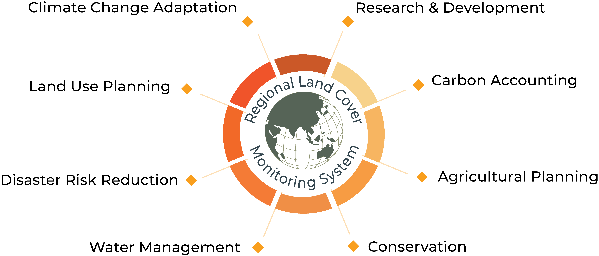

# About RLCMS

Monitoring land cover and land use change by providing accurate and timely land cover maps and information, plays a critical role in multiple sectors in the developing world including agricultural planning and food security, carbon accounting, water management and natural resource management. However, many developing countries, including those within the Lower Mekong region, lack the coordinated capacity to produce timely, and temporally comparable geospatial data products sufficient to meet their management needs.

The Regional Land Cover Monitoring System (RLCMS) was developed by SERVIR-Mekong with the support of the U.S. Forest Service, NASA Applied Science Program, Google, the University of Maryland and governments of countries in the Mekong region. The system utilizes satellite technology to facilitate the production of customized, high-quality regional land cover maps at a 30-m resolution for each year from 2000 to present, in addition to complimentary land cover information. Using publicly available global satellite data, such as Landsat and MODIS, makes the system easily transferable. The adaptable system framework allows for a customized service that is able to map different land cover typologies based on ongoing user needs and bespoke landscape monitoring objectives.

## A python package for co-development

The `rlcms` python package is meant to jump-start local mapping projects and provide a living co-development tool for regional and global collaborators to build methodologies and share reproducible results. 
